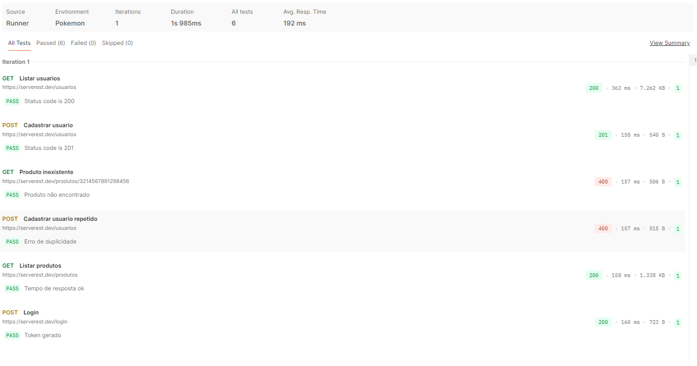

# S206 - Lista de Exercícios: Testes de API com Postman

Este repositório contém a resolução da Lista de Exercícios de Teste de API (S206), utilizando a ferramenta **Postman** para validar a API [ServeRest](https://serverest.dev/).

## Descrição do Projeto

O objetivo deste projeto é validar endpoints da API ServeRest através de testes automatizados, cobrindo cenários positivos (caminho feliz) e negativos (tratamento de erros), além de validações de performance e segurança básica.

### Ferramentas Utilizadas
* **Postman** (Criação e execução dos testes)
* **JavaScript** (Scripts de teste com biblioteca Chai)
* **Git/GitHub** (Versionamento)

---

## Cenários de Teste Desenvolvidos

A suíte de testes (`postman_lista2.json`) conta com **6 cenários** distintos:

1.  **Listar Usuários (GET):** Valida se a API retorna status 200 ao consultar a base.
2.  **Cadastrar Usuário (POST):** Cria um usuário com e-mail dinâmico para garantir sucesso (Status 201).
3.  **Produto Inexistente (GET) - *Caso Negativo*:** Tenta buscar um produto com ID inválido para validar o tratamento de erro (Status 400).
4.  **Cadastrar Usuário Repetido (POST) - *Caso Negativo*:** Tenta cadastrar um e-mail já existente para validar a regra de duplicidade (Status 400).
5.  **Listar Produtos (GET):** Valida requisitos não-funcionais, assegurando que o tempo de resposta seja inferior a 2000ms.
6.  **Login (POST):** Realiza a autenticação e valida se o Token de autorização foi gerado corretamente.

---

## Como Executar os Testes

Para rodar este projeto na sua máquina:

1.  **Clone o repositório:**
    ```bash
    git clone [https://github.com/SEU-USUARIO/SEU-REPOSITORIO.git](https://github.com/SEU-USUARIO/SEU-REPOSITORIO.git)
    ```
2.  **Importe no Postman:**
    * Abra o Postman.
    * Clique em **Import**.
    * Selecione o arquivo `postman_lista2.json` que está na pasta deste projeto.
3.  **Execute a Collection:**
    * Selecione a coleção importada.
    * Clique no botão **Run** (ou "Run collection").
    * Verifique se todos os testes passaram.

---

## Resultados dos Testes

Abaixo, a evidência da execução de todos os cenários via *Collection Runner* do Postman:



---

## Respostas do Questionário (Exercício 2)

**1. Quantas suítes de testes você desenvolveu?**
R: Foi desenvolvida 1 suíte de testes (Collection) contendo 6 casos de teste.

**2. Os testes desenvolvidos são manuais ou automatizados?**
R: São testes automatizados. Utilizamos scripts em JavaScript na aba "Tests" para validar as respostas da API sem intervenção humana durante a execução.

**3. Onde os testes se localizam na pirâmide apresentada?**
R: Localizam-se na camada de **Integração (Serviço)**. Eles testam a comunicação e a lógica da API diretamente, sem depender da interface gráfica (UI).

**4. Os testes desenvolvidos são funcionais ou não-funcionais?**
R: A maioria é **Funcional** (validam regras de negócio como cadastro e login). O teste "Listar produtos", que valida o tempo de resposta (< 2000ms), verifica um requisito **Não-Funcional** de performance.

**5. Alguns dos testes desenvolvidos são testes Fim-a-Fim (End-To-End)?**
R: Isoladamente, são testes de integração. Porém, o fluxo lógico (Criar Usuário -> Tentar Criar Duplicado -> Logar) simula um comportamento próximo ao End-to-End de backend.

**6. O que se deve fazer para que os testes desenvolvidos funcionem em modo regressão?**
R: É necessário exportar a coleção e utilizar o **Newman** (CLI do Postman) integrado a uma pipeline de CI/CD (como GitHub Actions). Assim, os testes rodariam automaticamente a cada atualização do código.

---

**Autores:**
* Fernanda Ellen de Souza
* Leonardo dos Santos Ferreira